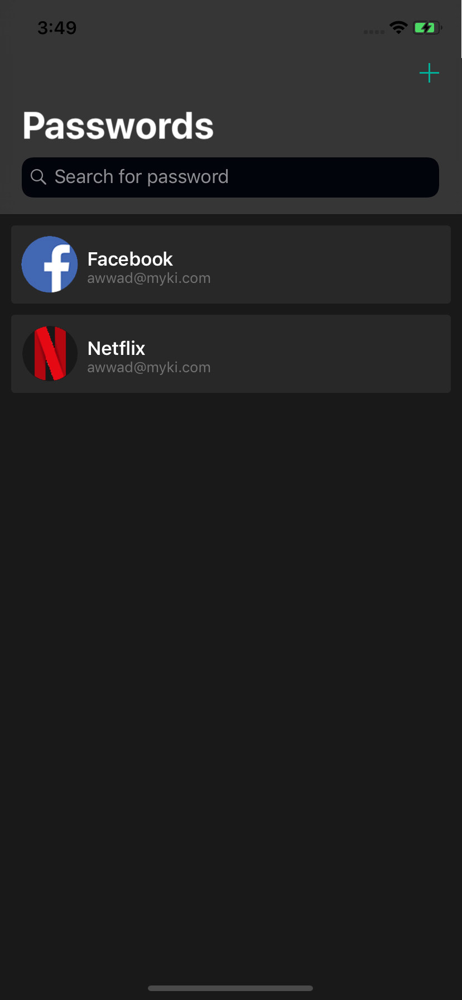
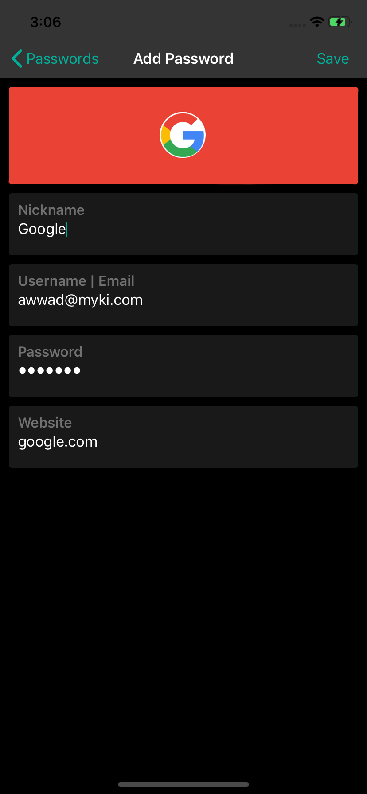
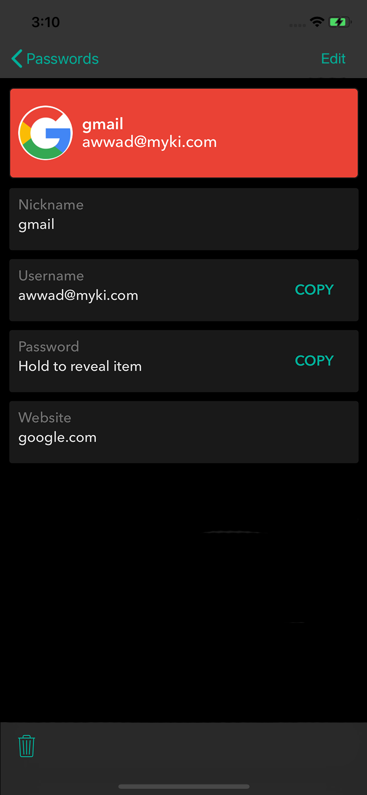

# Myki Code Challenge
#myki

Welcome to the coding exercise!

Clearly we think you’re awesome enough to have made it this far, so we would like you to show off your skills

# Scenario
As the iOS team, we have been tasked to implement a very simplified version of the Myki app. One of our team members has started to work on it but had to hand it over to you to wrap it up. They would also appreciate a code review from your end for their existing work. 

# Requirements
* Build a working example of functionality using the Myki app as a reference.
* The app consist of:
	* Passwords View screen, which will show all user’s passwords and will allow a user to add new passwords and search for them by “nickname, username”
	* Add Password View screen, where a user can add a new password with all of its details
	* Password View screen, which will show password’s details, allow a user to edit the password’s details, and allow a user to delete the password
* Fetch websites logos from this link: https://logo.clearbit.com, for more details on how to use it: https://blog.clearbit.com/logo/
* The app is available in English and French
* When adding a new password check if the password been leaked

### Passwords View
This screen is a simplified version of Myki app’s passwords page
* There are two components in this page
	* A search controller
	* A table view
	

* The Search bar filters passwords by nickname and username
* The Plus button to add new passwords, it directs to the Add Password View screen
* Clicking on one of the listed passwords directs the user to the Password View screen
* The listed passwords sorted by nickname

### Add Password View 
* This page involves one component, a table view that includes all password fields
* Nickname field is mandatory, a user cannot add password without a nickname
* After saving a new password, the user should be directed to the Passwords view with the new list of passwords
* Updating the website field would update the logo image

### Password View
* All password fields are editable
* The username and password fields can be copied to the clipboard
* Deleting a password will direct the user to the Passwords view after updating the passwords list
 

# Task
* Please complete the requirements. The current handover status from the previous developer is:
	* Passwords View screen has been implemented
	* Persistent storage using Realm has been implemented
	* Add Password View screen has been implemented
	* Password View screen is missing
* Provide UI/unit tests
* Use [Have I Been Pwned: API v3](https://haveibeenpwned.com/API/v3#PwnedPasswords), to check if entered password has been leaked

# Assessment Criteria
**You don’t have to finish it all!**

We strongly value quality over quantity in the code we ship. Imagine that you’re submitting this code to production.
Feel free to take advantage of libraries if you think they’re appropriate.

It’s important for us to see  
* how you work and communicate your thoughts
* your approach to architecture
* your attention to details
* how you prioritize

# Submission
To submit your solution, simply fork a private repo and add the reviewers usernames as reporters.

If something isn’t clear or you’re not sure about some requirements, don’t worry!
We want you to succeed too. We are a team after all so please email us on ios@myki.com and we can even jump on a video call. 

Have fun with it! Good luck!
